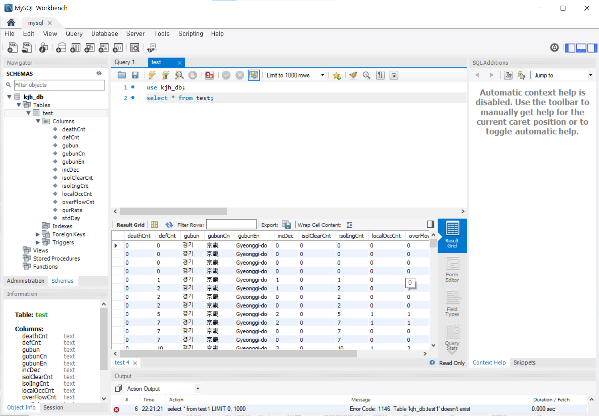

# 데이터 프레임 DB에 삽입하기
## DB 생성하기
```
centos  192.168.197.80
```
```sql
CREATE DATABASE kjh_db;
CREATE USER 'kjh'@'%' IDENTIFIED BY 'qwer1234';
GRANT ALL PRIVILEGES ON kjh_db.* TO 'kjh'@'%';
FLUSH PRIVILEGES;
```

## 오픈 API 불러오고 데이터프레임 으로 전처리
```python
import requests
import pandas as pd
import xmltodict

url = 'http://apis.data.go.kr/1352000/ODMS_COVID_04/callCovid04Api'
params ={'serviceKey' : '시크릿키', 'pageNo' : '1', 'numOfRows' : '500', 'apiType' : 'xml', 'gubun' : '경기' }
# db = client.test01

req = requests.get(url, params=params).content
xmlObject = xmltodict.parse(req)
dict_data = xmlObject['response']['body']['items']['item']
df_conf = pd.DataFrame(dict_data)
```

## DataFrame DB에 insert 하기
```python
import pymysql
from sqlalchemy import create_engine

### mysql 연결
MYSQL_HOSTNAME = '192.168.197.80:3306'  # 내 mysql ip
MYSQL_USER = 'kjh'  # 내가 생성한 user
MYSQL_PASSWORD = 'qwer1234'
MYSQL_DATABASE = 'kjh_db'   # 내가 생성한 db


connection_string = f'mysql+pymysql://{MYSQL_USER}:{MYSQL_PASSWORD}@{MYSQL_HOSTNAME}/{MYSQL_DATABASE}'
# connect_args = {'ssl': {'ca': '/content/rds-ca-2015-root.pem'}}

db = create_engine(connection_string)   # 내 db에 정보를 넘겨줌

## 내 db에 정보 insert
df_conf_1.to_sql(name='test', con=db, index=False)  # test라는 테이블로 데이터가 저장이 된다.
```

## 확인
<br/>
