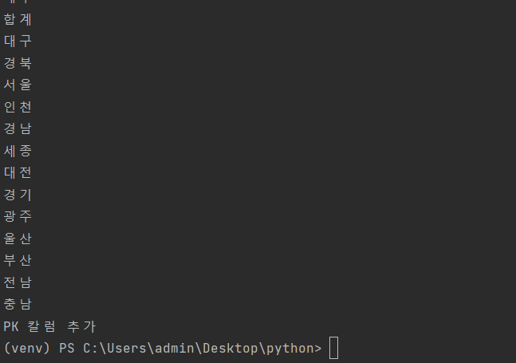
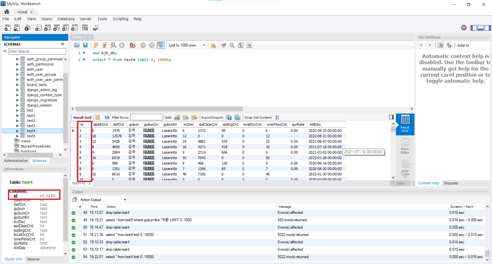
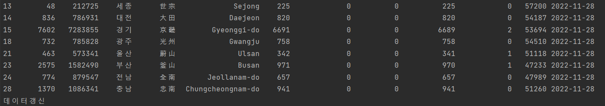
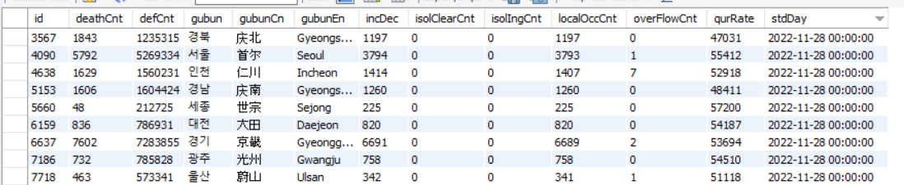

# 데이터 프레임 DB에 삽입하기
## DB 생성하기
```
centos  192.168.197.80
```
```sql
CREATE DATABASE kjh_db;
CREATE USER 'kjh'@'%' IDENTIFIED BY 'qwer1234';
GRANT ALL PRIVILEGES ON kjh_db.* TO 'kjh'@'%';
FLUSH PRIVILEGES;
```

## 오픈 API 불러오고 데이터프레임 으로 전처리
```python
import requests
import pandas as pd
import xmltodict

url = 'http://apis.data.go.kr/1352000/ODMS_COVID_04/callCovid04Api'
params ={'serviceKey' : '시크릿키', 'pageNo' : '1', 'numOfRows' : '500', 'apiType' : 'xml', 'gubun' : '경기' }
# db = client.test01

req = requests.get(url, params=params).content
xmlObject = xmltodict.parse(req)
dict_data = xmlObject['response']['body']['items']['item']
df_conf = pd.DataFrame(dict_data)
```

## DataFrame DB에 insert 하기
```python
import pymysql
from sqlalchemy import create_engine

### mysql 연결
MYSQL_HOSTNAME = '192.168.197.80:3306'  # 내 mysql ip
MYSQL_USER = 'kjh'  # 내가 생성한 user
MYSQL_PASSWORD = 'qwer1234'
MYSQL_DATABASE = 'kjh_db'   # 내가 생성한 db


connection_string = f'mysql+pymysql://{MYSQL_USER}:{MYSQL_PASSWORD}@{MYSQL_HOSTNAME}/{MYSQL_DATABASE}'
# connect_args = {'ssl': {'ca': '/content/rds-ca-2015-root.pem'}}

db = create_engine(connection_string)   # 내 db에 정보를 넘겨줌

## 내 db에 정보 insert
df_conf_1.to_sql(name='test', con=db, index=False)  # test라는 테이블로 데이터가 저장이 된다.
```

### 확인
<br/>


## OpenApi 전 지역 mysql에 insert하기
- 데이터 전처리 및 pk칼럼 추가
```python
url = 'http://apis.data.go.kr/1352000/ODMS_COVID_04/callCovid04Api'

gubun = ['검역', '전북', '충북', '강원', '제주', '합계', '대구', '경북', '서울', '인천', '경남', '세종', '대전', '경기', '광주', '울산', '부산', '전남', '충남']

# API 데이터 입력 함수로 생성
def api_to_mysql():
    for i in gubun:
        params = {'serviceKey': '시크릿키',
                  'apiType': 'xml',
                  'gubun': f"{i}" }
        # 데이터 전처리
        req = requests.get(url, params=params).content
        xmlObject = xmltodict.parse(req)
        dict_data = xmlObject['response']['body']['items']['item']
        df_conf = pd.DataFrame(dict_data)
        df_conf = df_conf.drop_duplicates(['gubun', 'stdDay'])

        # 칼럼 타입 변경
        df_conf_1 = df_conf.astype(
            {'deathCnt': 'int', "isolClearCnt": "int",
             "localOccCnt": "int", "overFlowCnt": "int", "stdDay": "datetime64"})
        print(i)
        # mysql에 insert 
        df_conf_1.to_sql(name='test4', con=db, if_exists = 'append', index= False)
    # 테이블에 PK 타입 칼럼 추가
    db.execute('ALTER TABLE test4 ADD COLUMN id INT(9) NOT NULL AUTO_INCREMENT PRIMARY KEY FIRST;')
    print("PK 칼럼 추가")

# api_to_mysql() 함수실행
api_to_mysql()
```
### 확인
<br/>
<br/>

## API 최신 데이터 불러오기
```python
def new_data():
    new_data = datetime.now().date() - timedelta(1)
    params = {'serviceKey': '시크릿키',
              'apiType': 'xml',
              'std_day': f"{new_data}" }
    req = requests.get(url, params=params).content
    xmlObject = xmltodict.parse(req)
    dict_data = xmlObject['response']['body']['items']['item']
    df_conf = pd.DataFrame(dict_data)
    df_conf = df_conf.drop_duplicates(['gubun', 'stdDay'])
    df_conf_1 = df_conf.astype(
        {'deathCnt': 'int', "isolClearCnt": "int",
         "localOccCnt": "int", "overFlowCnt": "int", "stdDay": "datetime64"})
    df_conf_1.to_sql(name='test4', con=db, if_exists='append', index=False)
    print(df_conf_1)
    print("데이터갱신")
```
### 확인
<br/>
<br/>

## sql중복된 데이터 삭제
```sql
-- mysql은 UPDATE 나 DELETE 시 자기 테이블의 데이타를 바로 사용 못한다. 그러므로 서브쿼리 결과를 임시테이블에 저장하여 사용해야한다.
DELETE FROM test4 WHERE id IN (select tmp2.id from(SELECT MAX(id) as id FROM test4 GROUP BY gubun, stdDay HAVING COUNT(*) > 1) as tmp2);
```