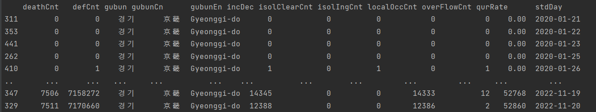

# API 데이터 전처리
```python
from pymongo import MongoClient
import requests
import pandas as pd
import xmltodict

url = 'http://apis.data.go.kr/1352000/ODMS_COVID_04/callCovid04Api'
params ={'serviceKey' : '공공API KEY', 'pageNo' : '1', 'numOfRows' : '500', 'apiType' : 'xml', 'gubun' : '경기' }

req = requests.get(url, params=params).content
xmlObject = xmltodict.parse(req)
dict_data = xmlObject['response']['body']['items']['item']  # response-body-items-item 에 있는 데이터 출력
df_conf = pd.DataFrame(dict_data)   # DataFrame 형식으로 변환
df_conf_1 = df_conf.sort_values(by='stdDay') # stdDay기준으로 정렬
print(df_conf_1)
```
