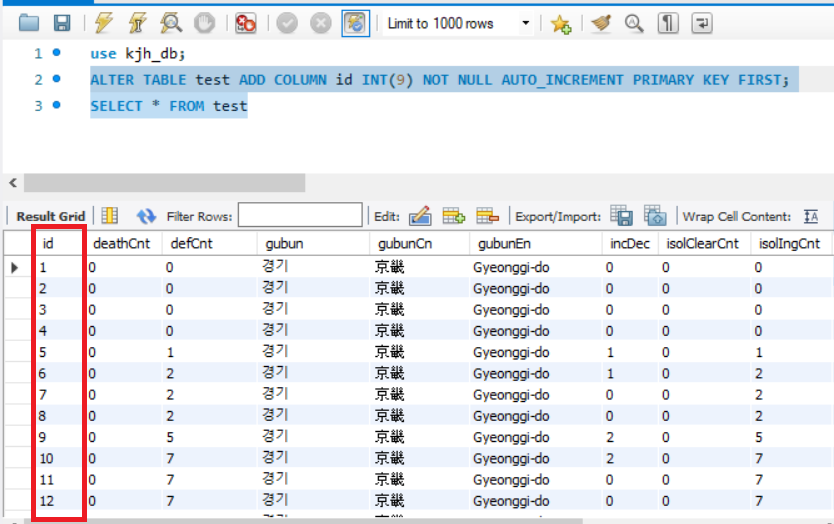
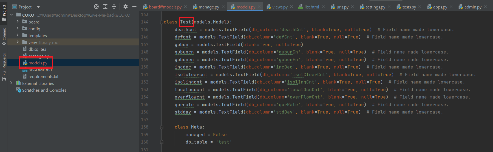
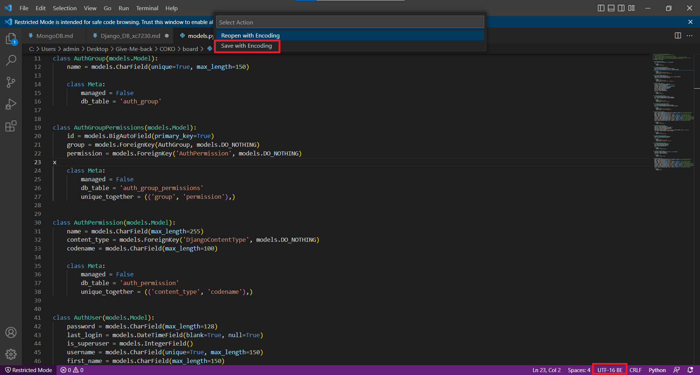
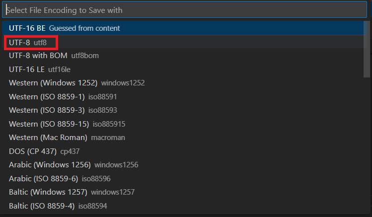
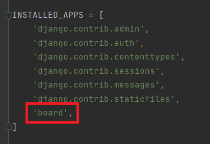
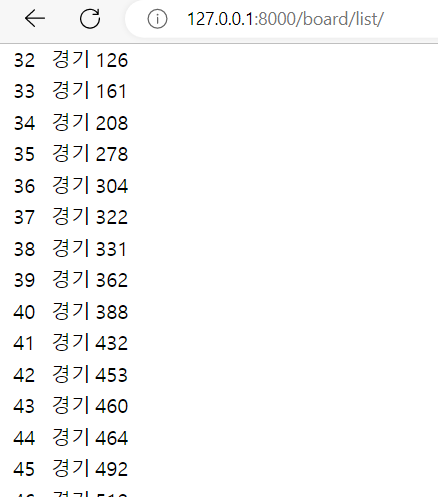

# Django로 Mysql 테이블 불러오기
## Mysql
- Django에서 DB를 불러오려면 테이블 칼럼에서 id가 필요하다. 만약 id가 없다면 따로 추가해줘야 한다.
```sql
ALTER TABLE test ADD COLUMN id INT(9) NOT NULL AUTO_INCREMENT PRIMARY KEY FIRST;
SELECT * FROM test
```
<br/>

## Django
### DB연동하기
`config/settings.py`
```python
DATABASES = {
    'default': {
        'ENGINE': 'django.db.backends.mysql',
        'NAME': 'kjh_db',
        'USER': 'kjh',
        'PASSWORD': 'qwer1234',
        'HOST': '192.168.197.80',
        'PORT': '3306',
        'OPTIONS': {
            'init_command': 'SET sql_mode="STRICT_TRANS_TABLES"'
        }
    }
}
```
```shell
pip install mysqlclient

python manage.py migrate
```

### Mysql 테이블 자동으로 Model 만들기
```shell
python manage.py inspectdb > models.py
python manage.py migrate
```
<br/>

- **주의**<br/>
    inspectdb 명령어를 사용하면 `models.py`의 형식이 UTF-16이 된다. 그러면 migrate가 되지 않으므로 UTF-8로 변경해준다.
    <br/>
    <br/>

### APP 추가
`config.settings.py`<br/>
<br/>


### 테이블 데이터 출력
`board/views.py`<br/>
```python
from django.shortcuts import render

from .models import Test

def list(request):
    posts = Test.objects.all()

    return render(request, 'board/list.html', {'posts': posts})
```
`config/urls.py`<br/>
```python
import board.views

urlpatterns = [
    path('admin/', admin.site.urls),
    path('board/list/', board.views.list),
]
```

`board/list.html`<br/>
```html
<body>
    <table>
        
            
                <tr>
                    <td>{{ post.id }}</td>
                    <td>{{ post.gubun }}</td>
                    <td>{{ post.isolclearcnt }}</td>
                </tr>
            
        
    </table>
</body>
```

### 확인
<br/>