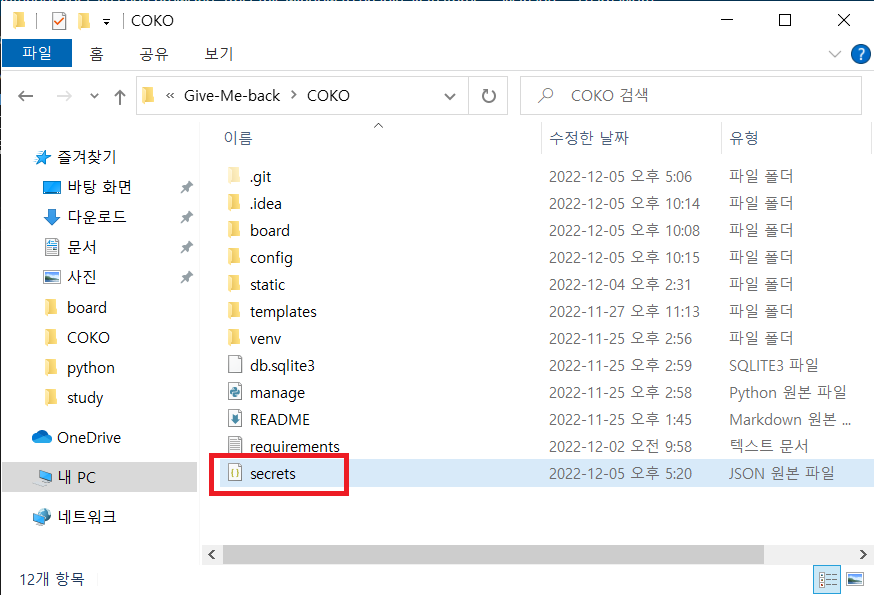
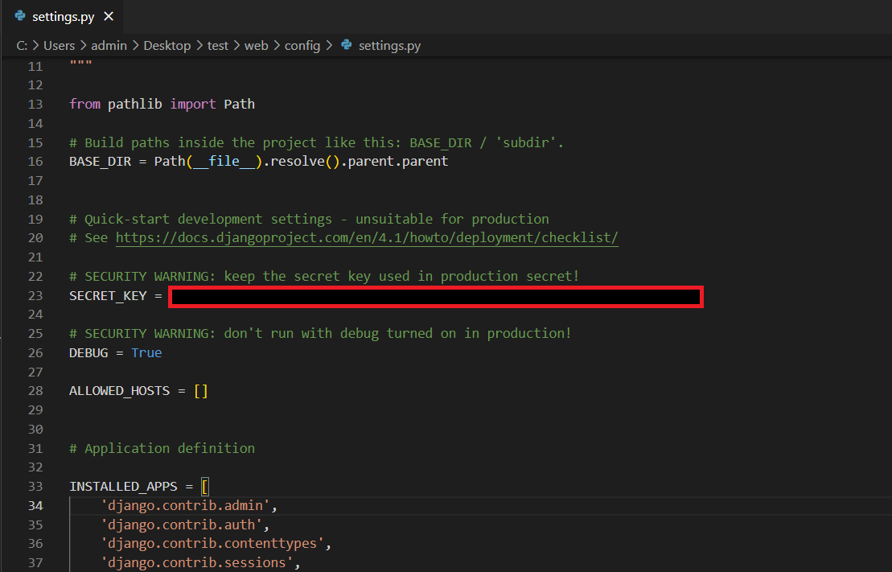
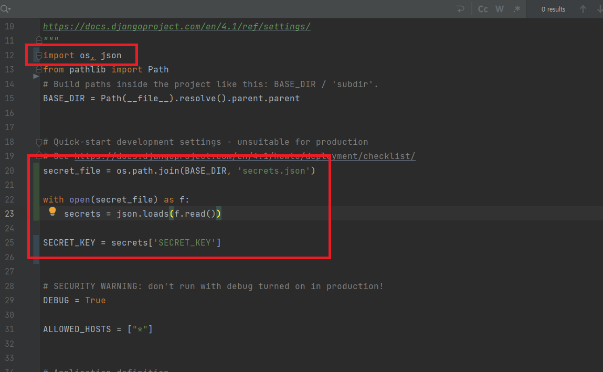
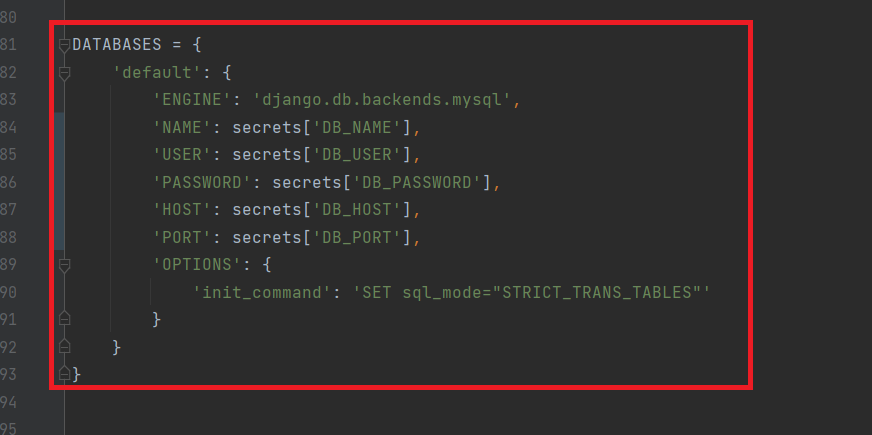
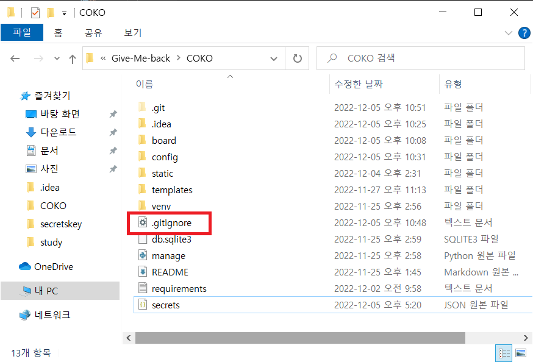
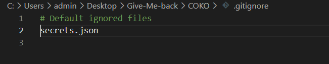
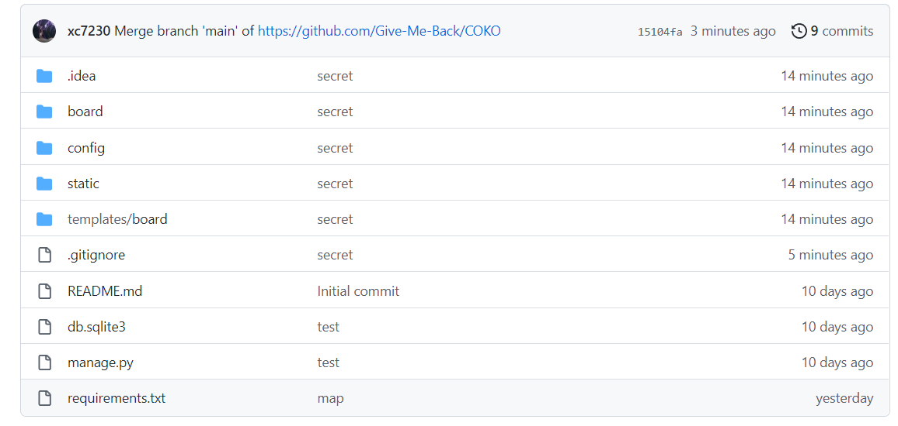

# Django Secrets 파일 만들기
장고를 Github에 업로드 하나보면 개인키가 노출될 수 있다. 그걸 방지하기 위해 개인 키들을 한 파일에 모아 개인적으로 관리 할 필요가 있다.

## Secrets파일 만들기
<br/>
다음과 같이 Django 기본 폴더에 `secrets.json` 파일을 생성해준다.<br/>

`secrets.json`
```json
{
    "SECRET_KEY": "SECRET_KEY입력",
    "DB_NAME": "DB 이름",
    "DB_USER": "DB USER 이름",
    "DB_PASSWORD": "비밀번호",
    "DB_HOST": "DB 주소",
    "DB_PORT": "3306"
}
```
SECRET_KEY는 `config/settings.py` 안에 있다.<br/>
<br/>

## Secrets파일 적용
`config/settings.py`<br/>
<br/>
<br/>
```python
import os, json

secret_file = os.path.join(BASE_DIR, 'secrets.json')

with open(secret_file) as f:
    secrets = json.loads(f.read())

SECRET_KEY = secrets['SECRET_KEY']


#### DATABASES 부분
DATABASES = {
    'default': {
        'ENGINE': 'django.db.backends.mysql',
        'NAME': secrets['DB_NAME'],
        'USER': secrets['DB_USER'],
        'PASSWORD': secrets['DB_PASSWORD'],
        'HOST': secrets['DB_HOST'],
        'PORT': secrets['DB_PORT'],
        'OPTIONS': {
            'init_command': 'SET sql_mode="STRICT_TRANS_TABLES"'
        }
    }
}
```

## GITHUB에 secrets 파일 제외시키기
<br/>
<br/>
`gitignore`
```
# Default ignored files
secrets.json
```

- 확인<br/>
이대로 commit - push를 하면<br/>
<br/>
`secrets.json`파일이 업로드 되지 않았다.<br/>

- 만약 파일이 올라갔을 경우<br/>
```shell
git rm -r --cached .
git add .
git commit -m
git pull
git push
```
git Bash에 다음과 같은 명령어를 입력 후 다시 업로드를 해준다.

