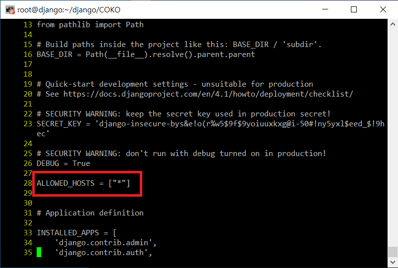
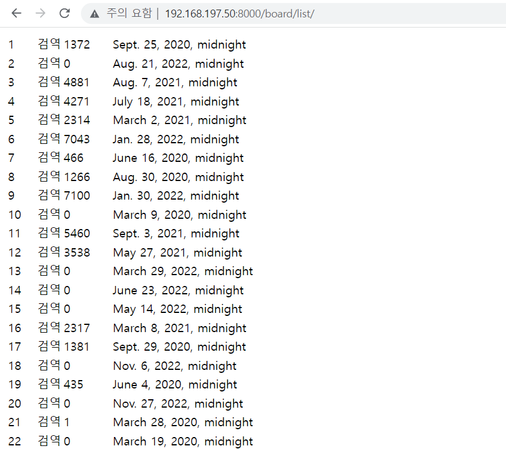

# Linux에서 Django실행 시키기
```shell
yum install -y git
mkdir django
cd django/

git init
# Git에 올라와 있는 Django 프로젝트 다운
git clone https://github.com/Give-Me-Back/COKO.git
cd COKO

yum install -y python39

# 이게 있어야 mysqlclient를 다운 할 수 있다.
yum install -y python39-devel mysql-devel gcc

# requirements.txt 안에 있는 라이브러리 다운
pip install -r requirements.txt
python3 manage.py makemigrations board
python3 manage.py migrate

vi config/settings.py
```
`settings.py`
<br/>
""안에 호스트 설정을 해준다. 전부 하고 싶으면 *을 입력한다.</br>


```shell

# 방화벽 해제
systemctl stop firewalld
systemctl disable firewalld
setenforce 0

# 서버 실행
python3 manage.py runserver 0.0.0.0:8000
```

- 확인<br/>
<br/>